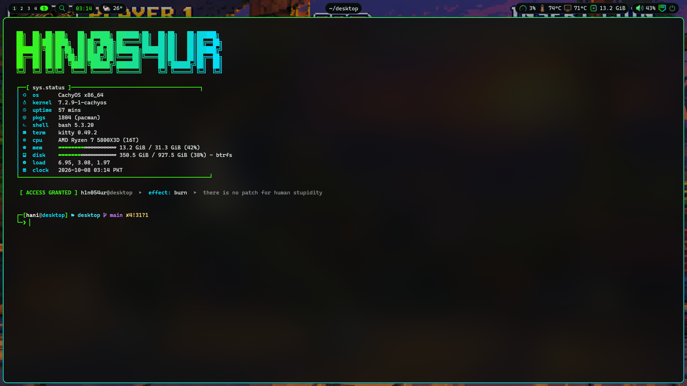
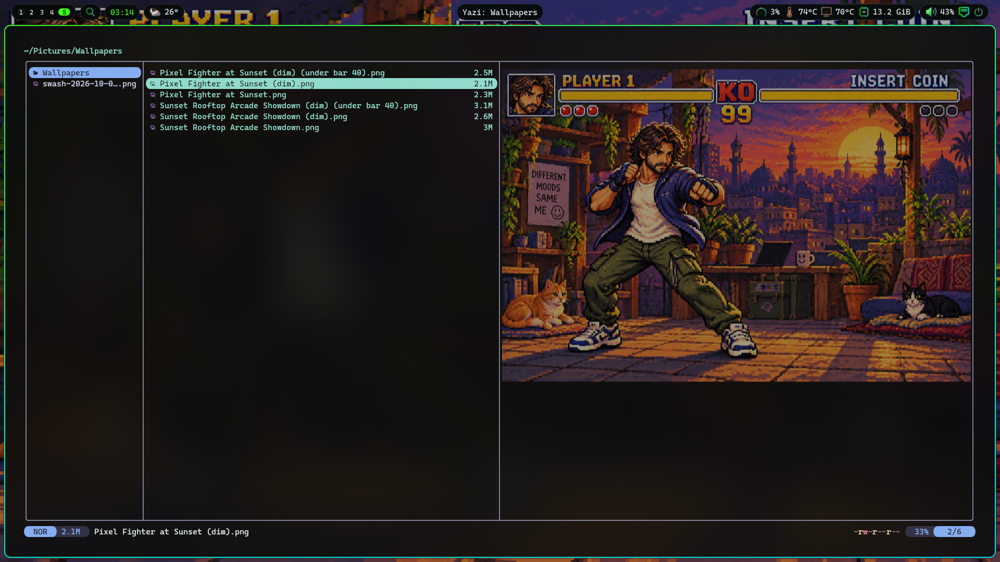
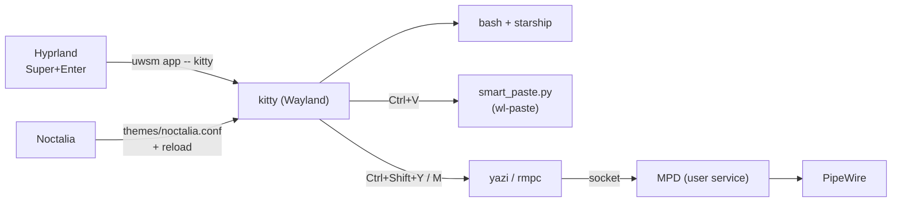
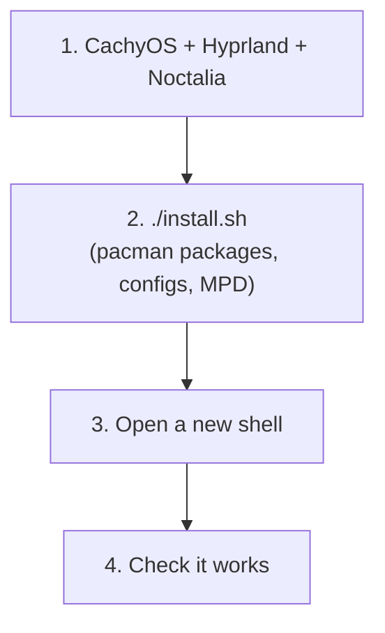

# kitty-config

My terminal setup on **CachyOS + Hyprland**: [kitty](https://sw.kovidgoyal.net/kitty/) with the CachyOS look and [Noctalia](https://github.com/noctalia-dev/noctalia-shell)'s colours, plus my Nerd Font, splits and paste keys on top; the [yazi](https://yazi-rs.github.io/) file manager with image and video previews; and [rmpc](https://rmpc.mierak.dev/) for music, including YouTube Music Premium, with album art and a cava visualizer. One `install.sh`.



| Splits | yazi |
|---|---|
|  |  |

rmpc isn't pictured, since it needs your own music library: it shows the queue on the left, album art on the right and cava's bars along the bottom.

## Platforms

| System | Install | Notes |
|---|---|---|
| Arch / CachyOS | `./install.sh` (pacman) | the full setup, with Noctalia's colours following the desktop |
| Debian / Ubuntu / WSL | `./install.sh` (apt) | kitty runs through WSLg on Windows; yazi, rmpc and the Nerd Font come from their release pages |
| macOS | `./install.sh` (Homebrew) | MPD runs as a `brew services` service; the shell snippet goes to `~/.zshrc` |

Without Noctalia (macOS, WSL, other desktops) the installer drops the `include themes/noctalia.conf` line, so kitty uses the Catppuccin Mocha colours from `ansi.conf`.

## What's inside

| Part | What it does | Controls and commands |
|---|---|---|
| **kitty** | The terminal: tabs, splits, images, smart paste for screenshots and copied files | [docs/kitty.md](docs/kitty.md) |
| **yazi** | File manager: image, video, PDF and archive previews; opens files in the desktop's apps | [docs/yazi.md](docs/yazi.md) |
| **Shell tools** | `y`, `z` / `zi`, fzf keys, fd, ripgrep, `ytm`, clipboard | [docs/shell-tools.md](docs/shell-tools.md) |
| **Music** | rmpc + MPD + cava: YouTube Music with Premium quality, album art, visualizer | [docs/music.md](docs/music.md) |
| **Troubleshooting** | Everything that broke while building this, and the fix | [docs/troubleshooting.md](docs/troubleshooting.md) |

## Cheat sheet

The keys you will use every day. Full lists are in the docs above.

| Keys / command | Does |
|---|---|
| `Super+Enter` | Open kitty (Hyprland bind, launched through `uwsm app`) |
| `Ctrl+V` / right click, `Ctrl+C` on a selection | Paste (screenshots go to Claude Code, files copied in Dolphin become paths), copy |
| Drag files from Dolphin onto kitty | Their paths are typed in |
| `Ctrl+Shift+T` / `Ctrl+Tab` | New tab / next tab |
| `Ctrl+Shift+D` | Move the tab into its own window |
| `Ctrl+Shift+Enter` / `Ctrl+Shift+\` | Split horizontally / vertically |
| `Ctrl+Shift+Arrows` / `Ctrl+Shift+Z` | Move between splits / zoom one |
| `Ctrl+Shift+=` / `-` | Bigger / smaller text |
| `Ctrl+Shift+Y` or `y` | yazi file manager |
| `Ctrl+Shift+M` or `rmpc` | Music player |
| `ytm <YouTube Music link>` / `ytm liked` | Queue a song or playlist / your liked songs |
| `:searchyt song name` (in rmpc) | Find a song on YouTube and queue it |
| `z <folder>` / `Ctrl+R` | Jump to a folder / search command history |
| `Ctrl+Shift+F5` | Reload the kitty config |

## How it fits together

kitty runs natively on Wayland under Hyprland. Noctalia generates the colour theme from the desktop palette, and Hyprland blurs what shows through kitty's 60% background.



## Set it up from scratch



### 1. Desktop

CachyOS with Hyprland and the Noctalia shell. `~/.config/hypr/config/variables.lua` sets `TERMINAL = "kitty"`, and Noctalia's kitty template must be enabled so it writes `~/.config/kitty/themes/noctalia.conf`. The [h1n054ur-terminal](https://github.com/h1n054ur/h1n054ur-terminal) setup adds the starship prompt and welcome screen. On macOS, WSL or another desktop, skip the Noctalia part: the installer falls back to the colours in `ansi.conf`.

### 2. Run the installer

```bash
git clone https://github.com/h1n054ur/kitty-config.git
cd kitty-config && ./install.sh
```

`install.sh` is safe to run again. It:

- installs kitty, yazi, fd, ripgrep, fzf, zoxide, rmpc, MPD, cava, yt-dlp, bun, the preview tools (ffmpeg, 7zip, poppler, imagemagick, resvg), wl-clipboard, CaskaydiaCove Nerd Font and the Noto fonts with `pacman -S --needed` (asks for sudo)
- copies the kitty and yazi configs into `~/.config` (existing files are kept as `.bak`) and installs the yazi theme and plugins with `ya pkg install`
- installs the `ytm` helper into `~/.local/bin`
- copies the MPD, rmpc, cava and yt-dlp configs and enables MPD as a user service (`systemctl --user enable --now mpd`); turns on the Chrome cookie login for YouTube when `~/.config/google-chrome` exists
- appends the `y` function, zoxide hook and fzf key bindings from `bashrc.snippet` to `~/.bashrc`

### 3. Check it works

| Check | Expected |
|---|---|
| `Super+Enter` | kitty opens, see-through and blurred, in the Noctalia colours |
| Change the wallpaper or colour scheme in Noctalia | open kitty windows recolour |
| Take a screenshot, then `Ctrl+V` in Claude Code | the screenshot is attached |
| Copy a file in Dolphin, `Ctrl+V` in kitty | its quoted path |
| `echo 🥟` | a colour dumpling |
| Run `claude` and call a tool | `⎿` under tool calls, `⏵⏵` for accept edits, plain `⏺` dots |
| `y`, then hover an image or video | a real image preview in the right pane |
| `Ctrl+Shift+Y` in kitty | yazi opens in a new tab |
| `rmpc searchyt "daft punk get lucky"`, then `Ctrl+Shift+M` | the song is queued with album art; `Enter` plays it and the visualizer moves |

## Look

| Setting | Value |
|---|---|
| Colours | Noctalia (`themes/noctalia.conf`, generated from the desktop palette) for background, tabs, borders and cursor; Catppuccin Mocha text and ANSI colours on top (`ansi.conf`) so the prompt, fastfetch, ls and git stay colourful |
| Window | CachyOS defaults: 60% background with Hyprland's blur, 25 px padding, cursor trail |
| Tabs | kitty's default bar in Noctalia's colours |
| Font | CaskaydiaCove Nerd Font Mono 11.5, ligatures on, 115% line height |
| Splits | `splits` and `stack` layouts, inactive splits dimmed to 75% |
| Symbols | `⎿ ⏵ ⏺ ⏸ ⏹ ⧉ ⧗` (Claude Code's connectors and markers) mapped to Noto symbol fonts, monochrome instead of emoji |
| Misc | copy on select, no bell, no close confirmation, 20k lines of scrollback |

## Updating

| Command | Does |
|---|---|
| `git pull && ./install.sh` | Update to the latest config in this repo (configs are backed up as `.bak`) |
| `sudo pacman -Syu` | Update kitty, yazi, rmpc, yt-dlp and the rest (when YouTube downloads break, a yt-dlp update is usually the fix) |
| `ya pkg upgrade` | Update yazi's theme and plugins |
| `fc-list ":charset=23bf" family` | Which fonts have a glyph (hex code point) |

## Repo layout

| Path | Installed to |
|---|---|
| `config/kitty/` | `~/.config/kitty/` (`kitty.conf`, `ansi.conf`, `smart_paste.py`) |
| `config/yazi/` | `~/.config/yazi/` (config, keymap, plugins list, theme) |
| `config/rmpc/` | `~/.config/rmpc/` (`config.ron`, `themes/catppuccin-mocha.ron`) |
| `config/mpd/mpd.conf` | `~/.config/mpd/mpd.conf` |
| `config/cava/config` | `~/.config/cava/config` |
| `config/yt-dlp/config` | `~/.config/yt-dlp/config` |
| `bin/ytm` | `~/.local/bin/` |
| `bashrc.snippet` | appended to `~/.bashrc` |
| `install.sh` | runs all of the above |
| `docs/` | controls, commands and troubleshooting per tool |

## Part of h1n054ur/desktop

This repo is generated from the `kitty/` folder of [h1n054ur/desktop](https://github.com/h1n054ur/desktop), the monorepo for my whole desktop setup. It is read-only: open issues and pull requests there.
