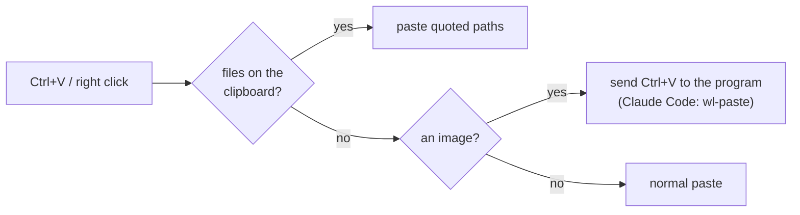

# kitty controls

`Ctrl+Shift` is kitty's modifier (`kitty_mod`). Everything below is what is actually bound with this config, dumped from kitty 0.49.2. Rows marked **custom** come from `kitty.conf`; the rest are kitty defaults.

## Window and app

| Keys | Action |
|---|---|
| `Ctrl+Shift+F11` | Toggle fullscreen |
| `Ctrl+Shift+F10` | Toggle maximized |
| `Ctrl+Shift+N` | New OS window |
| `Ctrl+Shift+F1` | Open the kitty docs |
| `Ctrl+Shift+F3` | Command palette (search every action) |
| `Ctrl+Shift+Esc` | kitty shell (remote-control prompt) |
| `Ctrl+Shift+Y` | Open yazi in a new tab, same directory (**custom**) |
| `Ctrl+Shift+M` | Open rmpc (music) in a new tab (**custom**) |

## Tabs

| Keys | Action |
|---|---|
| `Ctrl+Shift+T` | New tab in the current directory (**custom**) |
| `Ctrl+Shift+D` | Move the current tab into its own window (**custom**; dragging a tab off the tab bar does the same) |
| `Ctrl+Tab` | Next tab |
| `Ctrl+Shift+Tab` | Previous tab |
| `Ctrl+Shift+.` | Move tab forward |
| `Ctrl+Shift+,` | Move tab backward |
| `Ctrl+Alt+Shift+T` | Rename tab |
| `Ctrl+Shift+Q` | Close tab |

## Splits (kitty calls them windows)

| Keys | Action |
|---|---|
| `Ctrl+Shift+Enter` | Split horizontally, same directory (**custom**) |
| `Ctrl+Shift+\` | Split vertically, same directory (**custom**) |
| `Ctrl+Shift+Left` / `Right` / `Up` / `Down` | Focus the split in that direction (**custom**) |
| `Ctrl+Shift+Z` | Zoom the current split (toggle, **custom**) |
| `Ctrl+Shift+]` / `Ctrl+Shift+[` | Next / previous split |
| `Ctrl+Shift+1` ... `Ctrl+Shift+0` | Focus split 1 to 10 |
| `Ctrl+Shift+F7` | Pick a split by label |
| `Ctrl+Shift+F8` | Swap with a split by label |
| `Ctrl+Shift+F` / `Ctrl+Shift+B` | Move split forward / backward |
| `` Ctrl+Shift+` `` | Move split to the top |
| `Ctrl+Shift+R` | Resize mode: `W` wider, `N` narrower, `T` taller, `S` shorter, `R` reset, `Esc` done |
| `Ctrl+Shift+L` | Cycle layouts |
| `Ctrl+Shift+W` | Close split |

## Scrolling and search

| Keys | Action |
|---|---|
| `Ctrl+Shift+K` / `Ctrl+Shift+J` | Scroll one line up / down |
| `Ctrl+Shift+PgUp` / `PgDn` | Scroll a page |
| `Ctrl+Shift+Home` / `End` | Scroll to top / bottom |
| `Ctrl+Shift+X` | Jump to the next prompt |
| `Ctrl+Shift+/` | Search the scrollback |
| `Ctrl+Shift+H` | Open the scrollback in a pager |
| `Ctrl+Shift+G` | Open the last command's output in a pager |
| `Ctrl+Shift+Delete` | Clear the screen and scrollback |

## Copy and paste

| Keys | Action |
|---|---|
| `Ctrl+V` / right click | Smart paste (**custom**, `smart_paste.py`): screenshots go to the program (Claude Code attaches them), files copied in Dolphin paste as paths, anything else pastes as text |
| `Ctrl+Shift+V` | Plain text paste |
| `Ctrl+C` | Copy if text is selected, otherwise interrupt the running command as usual (**custom**) |
| `Ctrl+Shift+C` | Copy (selecting with the mouse also copies, **custom**) |
| `Ctrl+Shift+S` / `Shift+Insert` | Paste the primary selection |
| `Ctrl+Shift+O` | Send the selection to a program (opens URLs, files) |
| `Ctrl+Shift+U` | Unicode and emoji picker |

## Screenshots and copied files

`Ctrl+V` / right click run `smart_paste.py`, which looks at what the clipboard holds (`wl-paste --list-types`):

| You do | `Ctrl+V` in kitty gives |
|---|---|
| Take a screenshot, or copy an image | a real `Ctrl+V` to the program; Claude Code then reads the image with `wl-paste` and attaches it |
| `Ctrl+C` on files in Dolphin (one or several) | their paths, quoted when needed: `'/home/you/My Notes.txt' /tmp/a.png` |
| Copy text | the text |

Dragging files from Dolphin onto kitty also types their paths (kitty handles drops natively on Wayland).

## Hints (press the combo, then the letter shown on screen)

| Keys | Action |
|---|---|
| `Ctrl+Shift+E` | Open a URL on screen |
| `Ctrl+Shift+P` then `F` | Insert a file path from the screen |
| `Ctrl+Shift+P` then `Shift+F` | Open a file path from the screen |
| `Ctrl+Shift+P` then `L` | Insert a whole line |
| `Ctrl+Shift+P` then `W` | Insert a word |
| `Ctrl+Shift+P` then `H` | Insert a hash (git SHAs) |
| `Ctrl+Shift+P` then `N` | Open `file:line` in the editor |
| `Ctrl+Shift+P` then `Y` | Open a hyperlink |
| `Ctrl+Shift+P` then `C` | File picker, insert the chosen file |
| `Ctrl+Shift+P` then `D` | Directory picker, insert the chosen directory |

## Font and opacity

| Keys | Action |
|---|---|
| `Ctrl+Shift+=` / `Ctrl+Shift++` | Bigger font |
| `Ctrl+Shift+-` | Smaller font |
| `Ctrl+Shift+Backspace` | Reset font size |
| `Ctrl+Shift+A` then `M` / `L` | More / less opaque |
| `Ctrl+Shift+A` then `1` / `D` | Fully opaque / back to default |

The opacity keys only work if `dynamic_background_opacity yes` is set, which this config does not do.

## Config

| Keys | Action |
|---|---|
| `Ctrl+Shift+F2` | Edit `kitty.conf` |
| `Ctrl+Shift+F5` | Reload the config (window decorations need a full restart) |
| `Ctrl+Shift+F6` | Show the active config and bindings |

## Mouse

| Action | Result |
|---|---|
| Click | Select, open links, move the cursor on the prompt |
| Double / triple click | Select word / line |
| `Ctrl+Alt+drag` | Rectangle selection |
| Right click | Smart paste, same as `Ctrl+V` (**custom**) |
| `Shift+right click` | Extend the selection |
| Middle click | Paste the selection |
| `Ctrl+Shift+click` | Open the link under the cursor |
| `Ctrl+Shift+right click` | Show that command's output in a pager |

## Defaults this config replaces

The custom split keys take over some kitty defaults:

| Keys | kitty default | Now |
|---|---|---|
| `Ctrl+Shift+Left` / `Right` | previous / next tab | focus split left / right (use `Ctrl+Tab` for tabs) |
| `Ctrl+Shift+Up` / `Down` | scroll one line | focus split up / down (use `Ctrl+Shift+K` / `J`) |
| `Ctrl+Shift+Z` | jump to the previous prompt | zoom split |
| `Ctrl+Shift+Enter` | new split in the current layout | horizontal split in the current directory |
| `Ctrl+Shift+T` | new tab | new tab in the current directory |
| `Ctrl+V` | sent to the program (bash quoted-insert, vim visual block) | smart paste; still sent to the program when the clipboard holds an image or no text; use `Ctrl+Q` in vim for visual block |
| `Ctrl+C` | always interrupt | copy when text is selected, interrupt otherwise |
| Right click | extend the selection | paste (`Shift+right click` still extends) |

## kitty commands

| Command | Does |
|---|---|
| `kitty` | Open kitty (or `Super+Enter`) |
| `kitty --start-as=maximized` / `fullscreen` | Open maximized or fullscreen |
| `kitten icat image.png` | Show an image inline in the terminal |
| `kitten themes` | Browse and preview kitty colour themes |
| `kitten list-fonts` | List fonts kitty can use |
| `kitten unicode_input` | Unicode and emoji picker (same as `Ctrl+Shift+U`) |
| `kitten diff a b` | Side-by-side diff with syntax highlighting and images |
| `kitten ssh host` | SSH that carries kitty's terminfo and shell integration to the server |
| `kitty +runpy 'from kitty.config import load_config; print(load_config("/home/$USER/.config/kitty/kitty.conf").font_family)'` | Check the config parses (there is no `--debug-config` in 0.49) |

---

[Back to the README](../README.md)
