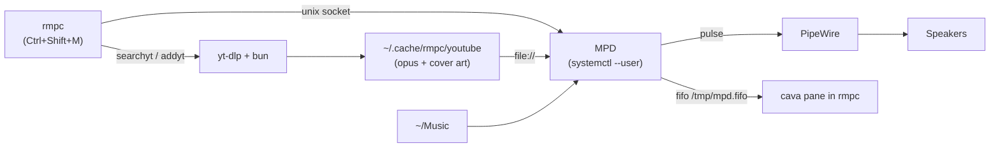
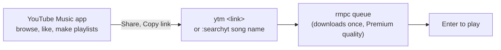

# Music: rmpc + MPD + cava

[rmpc](https://rmpc.mierak.dev/) is a terminal client for MPD (Music Player Daemon). It shows album art through kitty's image protocol, plays YouTube and YouTube Music through yt-dlp, and has [cava](https://github.com/karlstav/cava) built in as a visualizer pane.



- **Launch:** `Ctrl+Shift+M` in kitty, or `rmpc` in any shell. MPD runs in the background as a user service, so music keeps playing after you close rmpc.
- **Look:** Catppuccin Mocha theme (`config/rmpc/themes/catppuccin-mocha.ron`), big album art on the Queue tab, an 8-row visualizer strip (blue, mauve, pink gradient) above the progress bar, Nerd Font icons for songs, folders and playlists.
- **Your own files:** put them in `~/Music`; MPD picks them up automatically (`auto_update`), or press `Ctrl+U`.

## How to use it with YouTube Music

rmpc is a **player**, not a YouTube Music app: it cannot browse your YouTube Music library. Use the two together:

- **YouTube Music app or website** (phone, browser): browse, discover, like songs, make playlists, same as always.
- **rmpc in kitty**: play them, with album art and the visualizer.



**Play a specific song.** Open rmpc (`Ctrl+Shift+M`), type `:searchyt` and the song name, press `Enter`:

```
:searchyt sheff g neverland
:searchyt -i sheff g neverland      # pick from a list instead of taking the first match
```

**Play one of your playlists.** In YouTube Music: open the playlist, Share, Copy link. Then in any kitty shell:

```bash
ytm <paste link>          # Ctrl+V or right click pastes in kitty
```

**Play your liked songs:**

```bash
ytm liked
```

**Then in rmpc:**

| Key | Does |
|---|---|
| `Enter` | Play the highlighted song |
| `p` | Pause / resume |
| `>` / `<` | Next / previous |
| `.` / `,` | Volume up / down |
| `x` | Shuffle (random) on / off |
| `q` | Close rmpc; the music keeps playing |

Songs download before they play, so there is a short wait after adding (big playlists take a while; `od` in rmpc shows progress). Anything played before starts instantly and works offline.

## YouTube reference

rmpc downloads each track once with yt-dlp (audio, cover art and tags embedded) into `~/.cache/rmpc/youtube`, then plays it from there, so replays are instant and work offline.

| Where | Command | Does |
|---|---|---|
| inside rmpc | `:searchyt daft punk get lucky` | Searches YouTube and queues the first match |
| inside rmpc | `:searchyt --interactive --limit 10 daft punk` | Shows the top 10 results to pick from |
| inside rmpc | `:addyt <url>` | Queues a video or a **whole playlist**. Only `youtube.com` and `youtu.be` links: change `music.youtube.com` to `www.youtube.com` |
| shell | `ytm <url>...` | Queues YouTube **and YouTube Music** links (rewrites `music.youtube.com` for you) |
| shell | `ytm liked` | Queues your whole Liked Music (needs the login below) |
| shell | `rmpc searchyt "query"` / `rmpc addyt <url>` | Same as inside rmpc, even while rmpc is closed |
| inside rmpc | `od` | Shows downloads in progress |

Playlists live in YouTube Music: make and edit them in the app as usual, then `ytm <playlist link>` (Share, Copy link). A **song** link copied from inside a playlist carries `&list=...`, and rmpc then queues the whole playlist; delete that part to add just the song. Each track downloads before it is queued, so a big playlist (or `ytm liked`) takes a while; watch progress with `od` in rmpc. To keep a queue as a local MPD playlist, `Ctrl+S` then `a`, and load it later from the Playlists tab.

## YouTube Premium login

Optional. Without it, yt-dlp plays everything as a free user (up to ~160 kbps Opus). To use your Premium account (higher quality formats, members-only videos), sign in once in **Google Chrome** and let yt-dlp read its cookies:

```bash
google-chrome-stable https://music.youtube.com   # sign in with your Premium account
```

Then yt-dlp needs this line in `~/.config/yt-dlp/config` (`install.sh` enables it automatically when `~/.config/google-chrome` exists; otherwise uncomment it after installing Chrome):

```
--cookies-from-browser chrome
```

Close that Chrome window once you are signed in (Chrome only writes new cookies to disk every ~30 seconds or on exit), then check the login worked. Your Liked Music playlist only resolves when signed in; signed out it says `The playlist does not exist`:

```bash
yt-dlp --flat-playlist -I 1:3 --print title "https://www.youtube.com/playlist?list=LM"
yt-dlp -F "https://www.youtube.com/watch?v=5NV6Rdv1a3I" | grep -E '^(141|774) '   # Premium-only audio formats
```

Tracks downloaded before you signed in stay at free quality in `~/.cache/rmpc/youtube`; delete a file there and add the song again to re-download it at Premium quality (Opus ~268 kbps).

Why this way: exported `cookies.txt` files go stale as YouTube rotates them, while yt-dlp reads Chrome's profile (`~/.config/google-chrome`) fresh on every download. Stay signed in there; you do not need to keep it open. If downloads start failing with sign-in errors, open it again and reload YouTube.

## rmpc keys

Vim-style, like yazi. `?` shows everything inside rmpc; `:` opens the command prompt (any `rmpc` CLI command works there).

**Playback**

| Keys | Action |
|---|---|
| `p` | Play / pause |
| `s` | Stop |
| `>` / `<` | Next / previous track |
| `f` / `b` | Seek forward / back |
| `.` / `,` | Volume up / down |
| `z` / `x` / `c` / `v` | Toggle repeat / random / consume / single (lit up in the header) |
| `R` | Add random songs |

**Tabs**

| Keys | Action |
|---|---|
| `1` ... `7` | Queue, Directories, Artists, Album Artists, Albums, Playlists, Search |
| `Tab` / `Shift+Tab` (or `gt` / `gT`) | Next / previous tab |

**Moving and selecting**

| Keys | Action |
|---|---|
| `j` / `k` (or arrows) | Down / up |
| `h` / `l` | Back / into (browsers) |
| `gg` / `G` | Top / bottom |
| `Ctrl+U` / `Ctrl+D` | Half page up / down |
| `Ctrl+B` / `Ctrl+F` (or `PgUp` / `PgDn`) | Page up / down |
| `Ctrl+Arrows` or `Ctrl+W` then `h` `j` `k` `l` | Move between panes |
| `Space` | Select |
| `Ctrl+Space` | Invert selection |
| `/` then `n` / `N` | Find, next / previous match |
| `Enter` | Confirm (play in the queue, open in browsers) |
| `Esc` / `Ctrl+C` | Close a popup |

**Queue and library**

| Keys | Action |
|---|---|
| `a` / `A` | Add hovered / all to the queue |
| `d` / `D` (queue) | Remove song / clear queue |
| `K` / `J` | Move song up / down |
| `C` | Jump to the playing song |
| `X` | Shuffle the queue |
| `Ctrl+S` then `s` / `a` | Save selected / whole queue as a playlist |
| `Ctrl+R` | Rename (playlists) |
| `r` | Rate song |
| `Ctrl+Z` | Context menu |
| `i` | Focus the search input |
| `oi` / `oI` | Info for hovered / current song |
| `oo` / `op` / `od` | Outputs / decoders / downloads |
| `Ctrl+U` | Update the music library (for a full rescan type `:rescan`: kitty keeps `Ctrl+Shift+U` for its Unicode picker) |
| `q` | Quit rmpc (music keeps playing) |

## Visualizer

The cava pane inside rmpc reads raw audio from MPD's second output (`/tmp/mpd.fifo`, 44.1 kHz 16-bit stereo), so it only moves for music played by MPD. For a bigger standalone visualizer, open a kitty split (`Ctrl+Shift+Enter`) and run `cava`; `config/cava/config` uses the same fifo and gradient.

## Music commands

| Command | Does |
|---|---|
| `rmpc` (or `Ctrl+Shift+M`) | Open the player |
| `rmpc searchyt "query"` | Search YouTube and queue the first match |
| `rmpc searchyt -i -l 10 "query"` | Pick from the top 10 results (`--provider soundcloud` also works) |
| `rmpc addyt <url>` | Queue a YouTube video, YouTube Music track or whole playlist |
| `rmpc togglepause` / `play` / `pause` / `stop` | Playback |
| `rmpc next` / `prev` | Next / previous track |
| `rmpc seek +30` / `rmpc seek 90` | Seek relative / absolute (seconds) |
| `rmpc volume +5` / `rmpc volume 40` | Volume relative / absolute |
| `rmpc queue` / `rmpc song` / `rmpc status` | Show the queue / current song / playback status (JSON) |
| `rmpc clear` | Empty the queue |
| `rmpc add /` / `rmpc addrandom` | Add the whole `~/Music` library / random songs |
| `rmpc save <name>` / `rmpc load <name>` | Save the queue as a playlist / load one |
| `rmpc repeat on` / `random on` / `single on` / `consume on` | Modes (`toggle*` variants flip them) |
| `rmpc update` / `rmpc rescan` | Rescan `~/Music` |
| `rmpc outputs` / `disableoutput 0` / `enableoutput 0` / `toggleoutput 0` | List outputs / mute or unmute the speakers (output 0 is PipeWire, 1 is the cava fifo) |
| `rmpc albumart -o cover.jpg` | Save the current cover art |
| `rmpc remote switchtab Queue` / `rmpc remote keybind p` | Control a running rmpc from scripts |
| `rmpc debuginfo` | Check MPD connection, YouTube dependencies and image protocol |
| `rmpc config` / `rmpc theme` | Print the default config / theme |
| `cava` | Standalone visualizer (run it in a kitty split) |
| `systemctl --user status mpd` | Is MPD running |
| `systemctl --user restart mpd` / `stop mpd` | Restart / stop MPD (stopping it stops the music) |
| `journalctl --user -u mpd -f` | Follow MPD's log |
| `google-chrome-stable https://music.youtube.com` | Open Chrome to sign in to YouTube (Premium) |
| `yt-dlp --flat-playlist -I 1:3 --print title "https://www.youtube.com/playlist?list=LM"` | Check the YouTube login works |
| `ytm <url>...` / `ytm liked` | Queue YouTube or YouTube Music links / your Liked Music |
| `rm ~/.cache/rmpc/youtube/*` | Clear downloaded YouTube tracks (they re-download when added again) |

## Troubleshooting

- **MPD runs as your user** (`systemctl --user enable --now mpd`), not the system unit, so it can reach PipeWire and `~/Music`.
- **`:searchyt` says YouTube is unsupported**: rmpc's YouTube support needs `cache_dir` set and a **unix socket** connection to MPD (`address: "~/.local/state/mpd/socket"`), because it adds downloads as `file://` URIs, which MPD only accepts from local socket clients. `rmpc debuginfo` lists every missing piece.
- **yt-dlp needs a JavaScript runtime** for YouTube now (deno by default). `~/.config/yt-dlp/config` sets `--js-runtimes bun`.
- **Signed in but yt-dlp still sees you signed out**: Chrome had not written the login to disk yet. Close Chrome and check again.
- **`Unsupported host music.youtube.com`**: rmpc 0.11 only parses `youtube.com` and `youtu.be` URLs (newer unreleased rmpc adds `music.youtube.com`). Use `ytm`, or swap `music.` for `www.`; the ids are the same.
- **Album column says "Unknown Album"** for YouTube tracks: videos have no album tag. Artist, title, date and cover art are embedded.
- **Test without blasting sound**: `rmpc disableoutput 0` mutes the speaker output while the cava fifo keeps running; `rmpc enableoutput 0` restores it.
- **Check the visualizer feed**: while playing, `/tmp/mpd.fifo` delivers about 176 KB/s (44100 x 2 bytes x 2 channels).

---

[Back to the README](../README.md)
