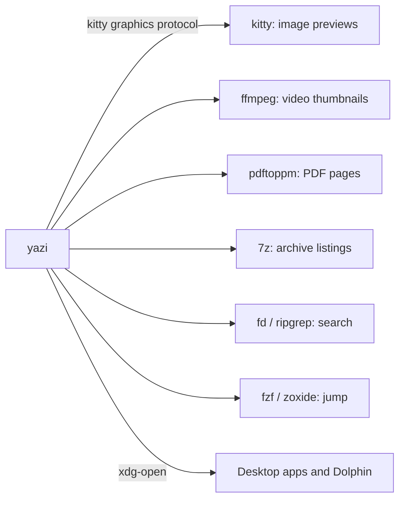

# yazi file manager

- **Launch:** `y` in the shell (quitting with `q` leaves you in the folder you were browsing, `Q` does not), or `Ctrl+Shift+Y` in kitty for a yazi tab.
- **Look:** Catppuccin Mocha flavor, rounded borders around all panes (`full-border`), file sizes shown, 1:3:4 column ratio with a large preview pane.
- **Git:** status signs next to files inside repos (`git` plugin).
- **Opening files:** `Enter` or `l` enters folders and opens files (`smart-enter`). Files open in the desktop's default app (image viewer, mpv, browser, PDF viewer) through `xdg-open`. Text files open in vim, with VS Code as a second choice under `O`.
- **Config:** `config/yazi/` (`yazi.toml`, `keymap.toml`, `init.lua`, `theme.toml`, `package.toml`). Update the theme and plugins with `ya pkg upgrade`.

## yazi keys

Vim-style. Press `~` or `F1` inside yazi for the full searchable list.

**Moving around**

| Keys | Action |
|---|---|
| `j` / `k` or `Down` / `Up` | Next / previous file |
| `h` / `Left` | Parent directory |
| `l` / `Right` / `Enter` | Enter directory or open file (**custom**, smart-enter) |
| `H` / `L` | Back / forward in history |
| `gg` / `G` (or `Home` / `End`) | Top / bottom |
| `Ctrl+U` / `Ctrl+D` | Half page up / down |
| `Ctrl+B` / `Ctrl+F` (or `PgUp` / `PgDn`) | Page up / down |
| `K` / `J` | Scroll the preview up / down |
| `gh` / `gc` / `gd` | Go to home / `~/.config` / `~/Downloads` |
| `gt` | Go to the trash bin |
| `g Space` | Type a path to jump to |
| `gf` | Follow the hovered symlink |
| `z` | Jump to a file or folder with fzf |
| `Z` | Jump to a frequent folder with zoxide |

**Selecting**

| Keys | Action |
|---|---|
| `Space` | Select / unselect and move down |
| `v` / `V` | Visual select / visual unselect mode |
| `Ctrl+A` | Select all |
| `Ctrl+R` | Invert selection |
| `Esc` | Clear selection, exit visual mode or cancel search |

**File operations**

| Keys | Action |
|---|---|
| `o` / `Enter` | Open (default app) |
| `O` / `Shift+Enter` | Choose how to open it (default app, show in Dolphin, or vim / VS Code for text) |
| `y` / `x` | Copy / cut |
| `p` / `P` | Paste / paste and overwrite |
| `Y` or `X` | Cancel the copy or cut |
| `-` / `_` | Symlink copied files (absolute / relative) |
| `Ctrl+-` | Hardlink copied files |
| `a` | New file (end the name with `/` for a folder) |
| `A` | Create several files at once |
| `r` | Rename (several selected files open a bulk rename in vim) |
| `d` | Move to trash |
| `D` | Delete permanently |
| `;` / `:` | Run a shell command / run and wait for it |
| `w` | Task manager (copies, deletes, previews in progress) |
| `Tab` | Spot: file details (size, dimensions, codec...) |

**Search, filter, sort, view**

| Keys | Action |
|---|---|
| `s` | Search file names (fd) |
| `S` | Search file contents (ripgrep) |
| `Ctrl+S` | Cancel a running search |
| `f` | Filter the current folder as you type |
| `/` / `?` | Find next / previous match |
| `n` / `N` | Next / previous match |
| `.` | Show / hide hidden files |
| `,m` `,b` `,e` `,a` `,n` `,s` `,r` | Sort by modified, created, extension, alphabetical, natural, size, random (capital letter reverses) |
| `ms` `mp` `mb` `mm` `mo` `mn` | Show size, permissions, created, modified, owner, or nothing next to files |

**Copy paths to the clipboard**

| Keys | Action |
|---|---|
| `cc` | Full path |
| `cd` | Folder path |
| `cf` | File name |
| `cn` | File name without extension |
| `cC` / `cD` | File / folder as a URL |

**Tabs and quitting**

| Keys | Action |
|---|---|
| `tt` | New tab in the current folder |
| `tr` | Rename tab |
| `1` ... `9` | Go to tab 1 to 9 |
| `[` / `]` | Previous / next tab |
| `{` / `}` | Move tab left / right |
| `Ctrl+C` | Close tab (quits on the last one) |
| `q` | Quit and `cd` the shell to the current folder (with `y`) |
| `Q` | Quit and stay where you started |
| `Ctrl+Z` | Suspend to the shell (`fg` to return) |
| `~` / `F1` | Help |

Inside the task manager (`w`) and spot view (`Tab`): `j`/`k` move, `Enter` inspects a task, `x` cancels it, `h`/`l` in spot flips to the previous or next file, `Esc` closes. Text inputs (rename, search, paths) support vim editing: `Esc` for normal mode, then `i`, `a`, `w`, `b`, `0`, `$` and so on.

## Troubleshooting

- **yazi config syntax changes between releases.** The opener fields here (`run`, `%s1`, `for = "linux"`) were read from the defaults compiled into yazi 26.9.1; check `strings $(which yazi) | grep -A5 '^\[opener\]'` after upgrading.

---

[Back to the README](../README.md)
